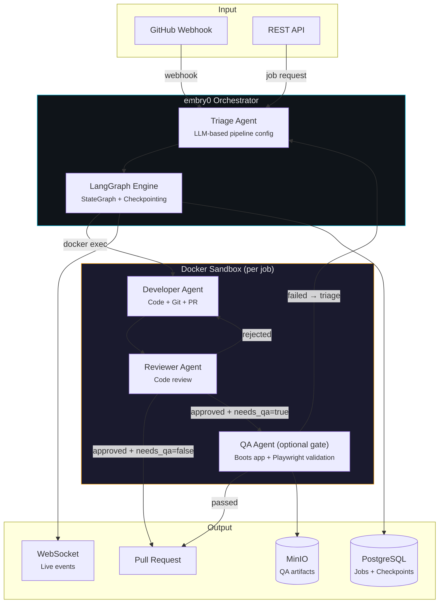

<div align="center">

# embry0

**Autonomous agent orchestration engine — GitHub issue in, reviewed pull request out.**

[](https://github.com/sudoTomas/embry0/actions/workflows/ci.yml)
[](https://python.org)
[](https://react.dev)
[](https://github.com/langchain-ai/langgraph)
[](LICENSE)

</div>

---

embry0 autonomously resolves GitHub issues by dispatching AI agents through a configurable pipeline: an LLM **triage agent** plans the work, a **developer agent** writes the code and opens the PR, a **reviewer agent** gates it, and an optional **QA agent** boots your full-stack app and validates acceptance criteria in a real browser. Built on **LangGraph** for orchestration and the **Claude Agent SDK** for execution, with every agent locked inside an isolated Docker sandbox.

**Core principle: no customer code retention.** Code exists only inside sandbox containers — when the container is destroyed, the code is gone.



## Features

- **Issue-to-PR pipeline** — triage scores confidence, splits oversized issues, and configures model tiers, validator modes, and sandbox profiles per job; the developer agent owns code, git, and PR creation; the reviewer loops it until approved.
- **Browser-verified QA gate** — boots your app's compose stack inside DinD and drives headless Chromium via Playwright against your acceptance criteria, with screenshots, console, network, and container logs as evidence.
- **Human-in-the-loop** — agents pause to ask questions, dispatched to the dashboard, Telegram, or a GitHub comment; the pipeline resumes when answered from any channel.
- **Issue tracker with GitHub two-way sync** — board and list views, webhook-triggered or manual dispatch.
- **Live dashboard** — React SPA streaming agent thinking, tool calls, costs, and QA evidence over WebSocket.
- **Budget controls** — per-job, daily, and monthly caps with soft/hard overrun modes.

## Security model

- **Sandbox isolation** — every job runs in its own container with `--cap-drop=ALL` and `--security-opt=no-new-privileges`, inside Docker-in-Docker.
- **Credentials never enter the sandbox** — three proxy services (git, GitHub API, auth) inject tokens transparently, gated by per-sandbox enrollment.
- **Dynamic network switching** — agents get internet access only when a step needs it.
- **Command safety** — 34 blocked bash patterns with NFKC unicode normalization, glob restriction, and symlink defense, enforced fail-closed before tool dispatch.

Found a vulnerability? See [SECURITY.md](SECURITY.md).

## Quick start

Requires Docker + Docker Compose and Python 3.12+.

```bash
git clone https://github.com/sudoTomas/embry0.git
cd embry0
cp .env.example .env
# Set in .env:
#   PROVIDER_MODE=anthropic_api (or claude_max)
#   ANTHROPIC_API_KEY=sk-ant-...   (or CLAUDE_CODE_OAUTH_TOKEN via `claude setup-token`)
#   GITHUB_TOKEN=ghp_...
#   API_KEY=$(python3 -c 'import secrets; print(secrets.token_hex(32))')
#   ENVIRONMENT_SECRET_KEY=$(openssl rand -hex 32)
#   POSTGRES_PASSWORD, MINIO_ROOT_PASSWORD, PROXY_ADMIN_TOKEN  (see .env.example)

pip install -e ".[dev]"   # installs the embry0 CLI
embry0 start              # builds images, starts the stack, waits for health
```

Open the dashboard at **http://localhost:8200**, create an issue, and click **Send to Agent**. To trigger jobs straight from GitHub, set up [webhooks](docs/webhooks.md).

## Documentation

| Guide | What's inside |
|---|---|
| [Architecture](docs/architecture.md) | Full system reference — topology, pipelines, sandbox and proxy design, storage, job lifecycle |
| [Configuration](docs/configuration.md) | Environment variables, secrets at rest, execution/auth modes, CLI reference |
| [API reference](docs/api.md) | REST endpoints with curl examples, WebSocket event stream |
| [Running QA](docs/running-qa.md) | Integrating a target repo, `qa.yaml`, gotchas, triggering and watching runs |
| [`qa.yaml` v2 reference](docs/qa-yaml-reference.md) | Field-by-field schema reference with monorepo examples |
| [Webhook setup](docs/webhooks.md) | Cloudflare Tunnel (production) and smee.io relay (local dev) |
| [Glossary](docs/glossary.md) | Domain vocabulary |

## Development

```bash
uv sync                          # or: pip install -e ".[dev]"
uv run pytest tests/unit -q      # fast unit suite
uv run ruff check embry0 tests
cd frontend && npm install && npm test
```

Contributions welcome — see [CONTRIBUTING.md](CONTRIBUTING.md) for the workflow and commit conventions.

## Roadmap

Kubernetes deployment (Helm, DinD → pod launching) · user-defined LangGraph workflows via API · pipeline template marketplace · configurable per-agent Claude Code skills.

## License

[AGPL-3.0](LICENSE) — use, modify, and self-host freely; if you offer a modified version as a network service, share your modifications under the same license.

---

<div align="center">
  <sub>Built with LangGraph, Claude Agent SDK, FastAPI, React, and PostgreSQL</sub>
</div>
