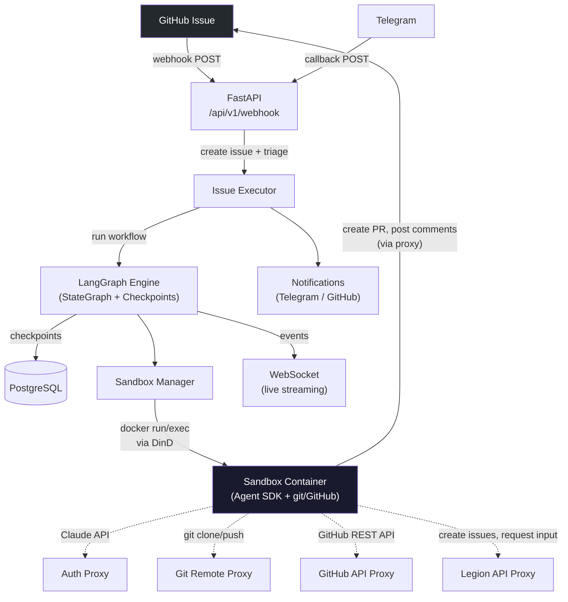
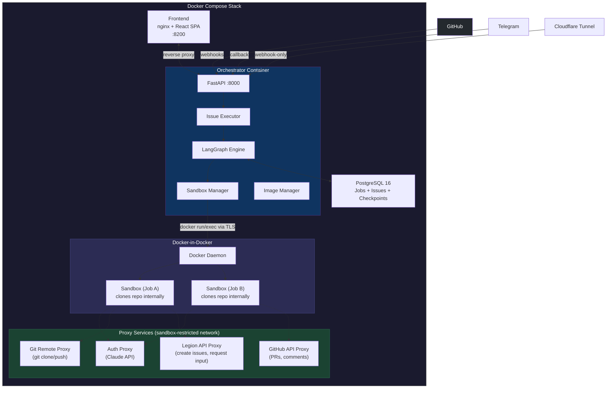
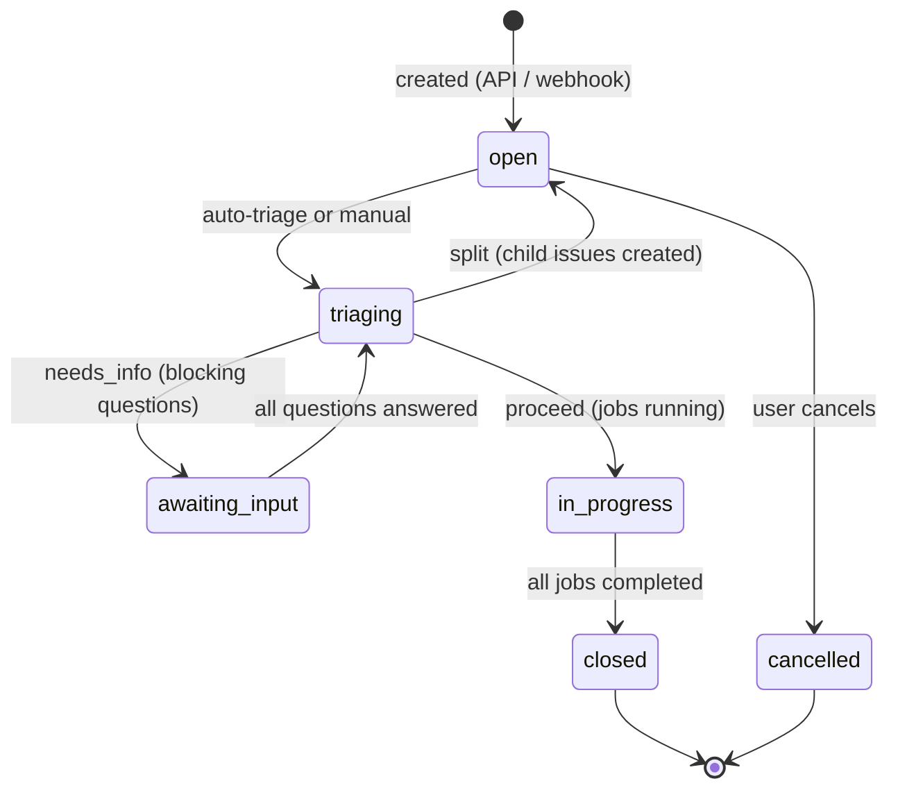
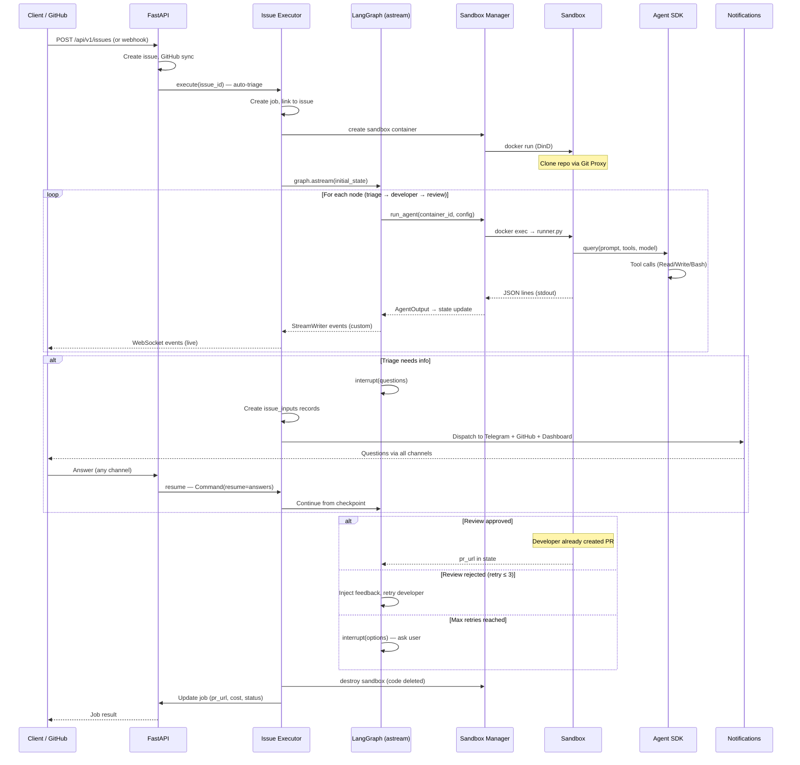
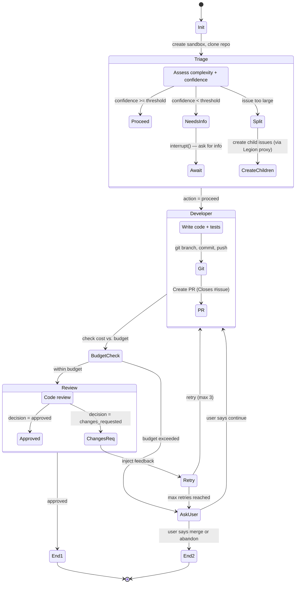
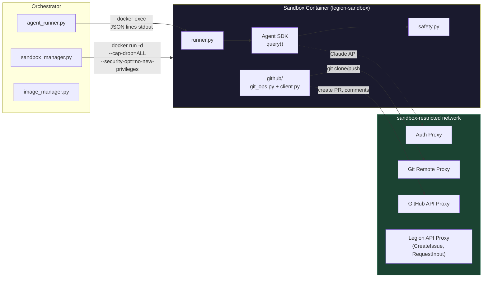
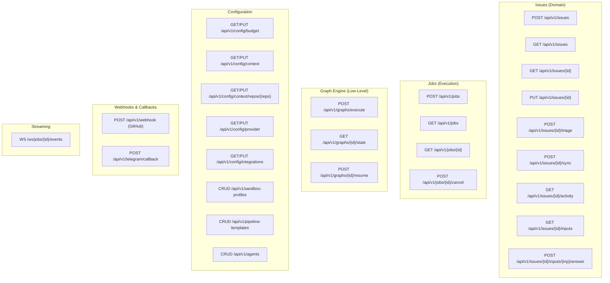
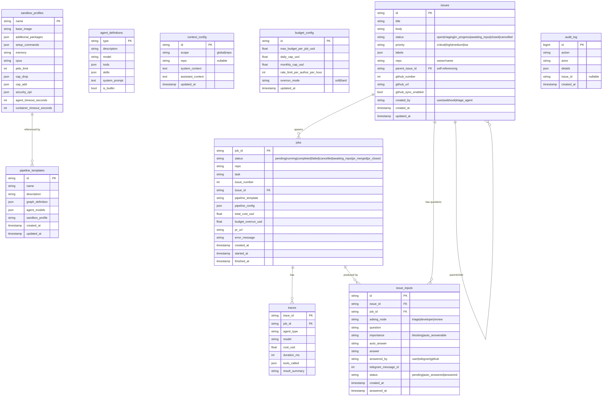
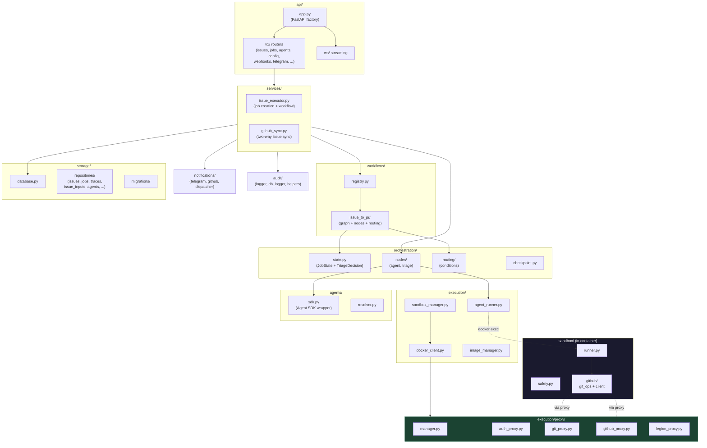
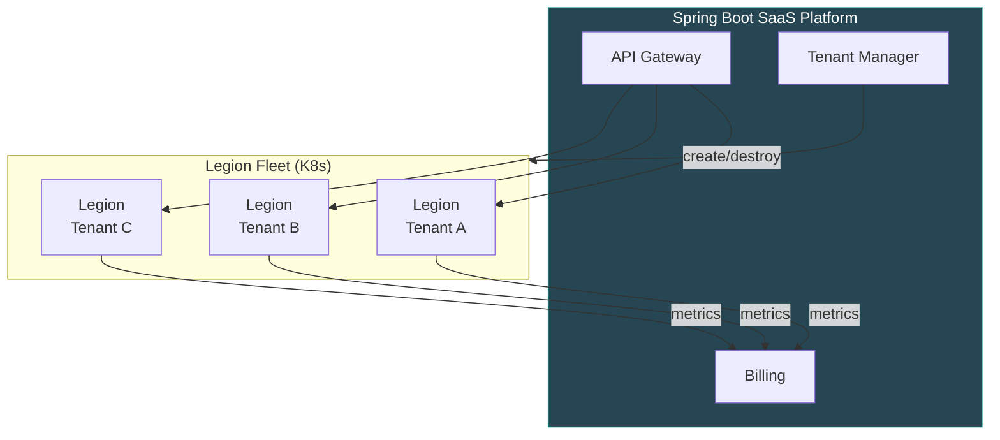

# Legion Architecture

Detailed technical documentation of the Legion agent orchestration engine.

---

## System Overview

Legion is a general-purpose agent orchestration engine built on LangGraph and Claude Agent SDK. GitHub issues or API requests create issues which are triaged by an LLM agent, questions are dispatched to the user via multiple channels (Dashboard, Telegram, GitHub), agents execute inside Docker sandboxes, and on success a PR is opened automatically. Customer code never persists on the host — it lives only inside ephemeral sandbox containers.

---

## Deployment Topology

One Docker Compose stack per tenant. No shared workspace volumes — sandbox containers clone repos internally and code is deleted on teardown.

### Docker Network Segmentation

| Network | Services | Purpose |
|---------|----------|---------|
| `frontend` | Frontend, Orchestrator | Isolates frontend from database/DinD |
| `backend` | Orchestrator, PostgreSQL, DinD | Backend services only |
| `sandbox-restricted` | Proxy services, Sandbox containers | No internet, proxy-only access |
| `sandbox-internet` | Sandbox containers (research only) | Filtered egress for web search |

### Services

| Service | Image | Purpose | Resources |
|---------|-------|---------|-----------|
| Frontend | `legion-frontend` | nginx serving React SPA, reverse proxy | — |
| Orchestrator | `legion-orchestrator` | FastAPI + LangGraph, job management, proxy services. Never touches customer code. | configurable via `.env` |
| PostgreSQL | `postgres:16` | Application data + LangGraph checkpoints | configurable via `.env` |
| DinD | `docker:dind` | Runs sandbox containers (privileged) | configurable via `.env` |

No shared workspace volumes. All resource limits, ports, image tags, and credentials are configurable via `.env` file.

---

## Issues & Human-in-the-Loop

Issues are first-class entities in Legion — independent of jobs. An issue is the **what** (the problem/request), a job is the **how** (the execution). Issues support optional two-way GitHub sync and can be decomposed into child issues by the triage agent.

### Issue Lifecycle

### Multi-Channel Notifications

When the pipeline needs human input (`interrupt()`), questions are dispatched to three channels simultaneously:

| Channel | Mechanism | Answer Matching |
|---------|-----------|----------------|
| **Dashboard** | Questions panel on issue detail page | `POST /api/v1/issues/{id}/inputs/{input_id}/answer` |
| **Telegram** | Per-question message with inline buttons | Reply-to-message matching via `telegram_message_id` |
| **GitHub** | Comment on linked GitHub issue | `issue_comment.created` webhook |

Answers from any channel trigger cross-channel sync (e.g., answer via Telegram → edit GitHub comment). When all blocking questions are answered, the pipeline resumes automatically.

### GitHub Two-Way Sync

- **Outbound (Legion → GitHub):** Issue create/update pushes to GitHub API
- **Inbound (GitHub → Legion):** Webhook handles `issues.opened`, `issues.edited`, `issues.closed`, `issues.reopened`, `issues.labeled`, `issues.unlabeled`, `issue_comment.created`
- **Conflict handling:** Last-write-wins with timestamps

---

## Request Lifecycle

End-to-end flow from issue creation to PR:

---

## Issue-to-PR Pipeline

The built-in workflow. The triage node uses an LLM to assess complexity, configure the pipeline, and determine if more information is needed or the issue should be split.

### Graph Nodes

| Node | Agent? | Tools | Purpose |
|------|--------|-------|---------|
| `init` | No | — | Create sandbox container, clone repo |
| `triage` | Yes | Read, Glob, Grep | Analyze issue, configure pipeline. Can `interrupt()` for questions. |
| `developer` | Yes | Read, Write, Edit, Bash, Glob, Grep | Write code, create branch, commit, push, open PR |
| `review` | Yes | Read, Bash, Glob, Grep | Code review with structured JSON output. Can request changes (triggers retry). |
| `retry` | No | — | Inject review feedback into state, increment counter |
| `max_retries` | No | — | `interrupt()` — ask user: continue, merge as-is, or abandon |

### Triage Decision

The LLM triage node outputs a pipeline configuration.

| Field | Type | Purpose |
|-------|------|---------|
| `action` | `proceed \| needs_info \| split` | What to do next |
| `confidence` | `float (0.0-1.0)` | Confidence in implementation approach |
| `pipeline_template` | `str` | Template name or "custom" |
| `pipeline_config.sandbox_profile` | `str` | Sandbox profile name |
| `pipeline_config.agent_models` | `dict[str, str]` | Model per agent |
| `pipeline_config.max_feedback_loops` | `int` | Review → retry cycles (default: 3) |
| `pipeline_config.reviewer_enabled` | `bool` | Whether review is included (default: true) |
| `pipeline_config.validator_modes` | `list[str]` | Which validators to run (test, lint, typecheck) |
| `pipeline_config.budget_usd` | `float` | Suggested budget for this job |
| `questions` | `list[dict]` | When `needs_info`: `{question, importance, suggested_answer}` |
| `sub_tasks` | `list[dict]` | When `split`: `{task, description}` objects |
| `reasoning` | `str` | Why this configuration was chosen |

### LangGraph Native Patterns

| Pattern | Usage |
|---------|-------|
| `interrupt(value)` | Pause graph for human input (triage questions, max retries) |
| `Command(resume=value)` | Resume paused graph with user's answer |
| `get_stream_writer()` | Nodes emit custom events (progress, tool calls, PR created) |
| `graph.astream(stream_mode=["updates", "custom"])` | Executor captures live events |
| `config["configurable"]` | Dependency injection: AgentRunner, SandboxManager, proxy URLs |

---

## Sandbox Container Architecture

Each job gets one Docker sandbox inside DinD. The sandbox clones the repo, agents execute inside it, and all git/GitHub operations happen within. When destroyed, all customer code is deleted.

### Container Security

| Control | Implementation |
|---------|---------------|
| Capability drop | `--cap-drop=ALL` (configurable: `cap_add` escape hatch) |
| Privilege escalation | `--security-opt=no-new-privileges` |
| Resource limits | `--memory`, `--cpus`, `--pids-limit` (all configurable) |
| Filesystem | Writable root (read-only disabled — Claude CLI requires writable fs), writable `/tmp` (tmpfs, noexec, nosuid), writable `/workspace` |
| Network | `sandbox-restricted` (default) or `sandbox-internet` (research agents) |
| Credentials | Injected via proxies (see Proxy Services) — `GITHUB_TOKEN` and `ANTHROPIC_API_KEY` never enter the sandbox env. **Scoped exception:** `CLAUDE_CODE_OAUTH_TOKEN` is passed to the sandbox env in Claude Max mode because the Claude CLI reads it directly from env (product constraint, not a deferred fix). |
| Command blocking | 34 regex patterns, NFKC unicode normalization, Glob path restriction, symlink defense via `os.path.realpath()` |
| Code retention | None — repo cloned inside container, deleted on teardown |
| OAuth credentials | Mounted read-only from orchestrator (`~/.claude`) |

**Sandbox env surface:** The container env contains only non-sensitive config: `LEGION_GIT_PROXY_URL` (just the proxy URL; not a secret), plus `CLAUDE_CODE_OAUTH_TOKEN` when Claude Max OAuth mode is active (see the Credentials row above). No `GITHUB_TOKEN`. No `ANTHROPIC_API_KEY`.

### Sandbox Image Management

The `SandboxImageManager` handles image lifecycle inside DinD:

- **Auto-build on startup** — computes SHA256 hash of `Dockerfile.sandbox` + sandbox source files, compares with image label `legion.build-hash`, rebuilds if stale
- **Profile-specific images** — `legion-sandbox:{profile_name}` extends the base image with additional packages/commands
- **Container reaper** — background task destroys containers older than 24 hours

---

## Proxy Services

Four proxy services run on the `sandbox-restricted` network.

**Credential injection via proxies** — GitHub auth flows exclusively through the git credential proxy (port 9101): the sandbox's git credential helper curls the proxy, which injects the orchestrator's `GITHUB_TOKEN` in the response. `GITHUB_TOKEN` is never present in the sandbox env. The auth proxy (port 9100) for Anthropic API keys is started but not currently wired into the sandbox runner — currently unused. **Scoped exception:** `CLAUDE_CODE_OAUTH_TOKEN` is passed into the sandbox env when Claude Max OAuth mode is active, because the Claude CLI reads it directly from env. This is a product-level constraint (the CLI doesn't support per-request injection for OAuth), not a deferred fix.

| Proxy | Port | Purpose | Credential Injected |
|-------|------|---------|-------------------|
| Auth Proxy | 9100 | Claude API requests | `x-api-key` header |
| Git Remote Proxy | 9101 | `git clone/push` | Git credential helper response |
| GitHub API Proxy | — | GitHub REST API (PRs, comments) | `Authorization: Bearer` header |
| Legion API Proxy | 9102 | Legion internal API (per-job) | Scoped to current issue/job |

### Legion API Proxy

Gives sandbox agents controlled access to Legion's own API, scoped to the current job's issue:

| Tool | Endpoint | Used By |
|------|----------|---------|
| `CreateIssue` | `POST /create-issue` | Triage (split), Developer (scope expansion) |
| `RequestInput` | `POST /request-input` | Any agent — triggers `interrupt()` |
| `UpdateStatus` | `POST /update-status` | Any agent — activity feed update |

---

## Context Injection

Agents receive injectable context at two levels, configurable via API:

| Level | Purpose | Example |
|-------|---------|---------|
| System prompt | Coding standards, architecture guidelines, team conventions | "Use TypeScript strict mode. Follow hexagonal architecture." |
| Assistant prompt | Issue-specific instructions, prior context, exploration hints | "The auth module was refactored last week — see PR #142." |

Context scopes (merged in order, later overrides earlier):

| Scope | Config via | Applies to |
|-------|-----------|------------|
| Global | `PUT /api/v1/config/context` | All jobs |
| Per-repo | `PUT /api/v1/config/context/repos/{repo}` | All jobs for that repo |
| Per-job | `POST /api/v1/jobs` body | Single job |

---

## API Structure

Three-level API: issues (domain), jobs (execution), graph engine (low-level). Plus configuration, streaming, and webhooks.

---

## Storage

PostgreSQL serves dual duty: application data and LangGraph checkpoints.

LangGraph checkpoint tables (`checkpoints`, `checkpoint_blobs`, `checkpoint_writes`) are managed by `langgraph-checkpoint-postgres` and provide pause/resume, time-travel debugging, and state inspection.

---

## Budget Controls

Three layers of cost protection, all configurable via API (`GET/PUT /api/v1/config/budget`):

| Control | Config Variable | Default | API Endpoint |
|---------|----------------|---------|--------------|
| Per-job budget | `MAX_BUDGET_USD` | $10.00 | `PUT /api/v1/config/budget` |
| Daily cap | `DAILY_BUDGET_CAP_USD` | $100.00 | `PUT /api/v1/config/budget` |
| Monthly cap | `MONTHLY_BUDGET_CAP_USD` | $500.00 | `PUT /api/v1/config/budget` |
| Rate limit | `RATE_LIMIT_PER_AUTHOR_PER_HOUR` | 5 | `PUT /api/v1/config/budget` |
| Overrun mode | `BUDGET_OVERRUN_MODE` | `soft` | `PUT /api/v1/config/budget` |

---

## Module Dependency Graph

---

## External Integrations

### Cloudflare Tunnel (production webhook ingress)

The public endpoint at `legion.alchymielabs.com` is restricted to webhook paths only:

| Path | Service | Purpose |
|------|---------|---------|
| `/api/v1/webhook` | GitHub webhook | Issue events, PR events, comments |
| `/api/v1/telegram/callback` | Telegram Bot API | Reply-to-message answers |
| Everything else | **403 Forbidden** | Dashboard only accessible on LAN |

Signature verification is always on in production: `GITHUB_WEBHOOK_SECRET` is set and the handler enforces HMAC-SHA256 (`verify_webhook_signature` in `legion/api/auth.py`).

### smee.io Relay (local development webhook ingress)

For developer laptops without a public URL, Legion supports the [smee.io](https://smee.io) relay pattern. The GitHub webhook is pointed at a smee channel URL, and `smee-client` forwards received events to `http://localhost:8200/api/v1/webhook`. Because smee re-serializes the JSON payload before forwarding, GitHub's HMAC signature is invalidated — so this flow requires `DEV_MODE=true` and an empty `GITHUB_WEBHOOK_SECRET`.

The handler in `legion/api/v1/webhooks.py` supports this flow in two ways:

1. `verify_webhook_signature(..., dev_mode=True)` skips HMAC verification when no secret is configured.
2. After JSON parsing, the handler detects and unwraps smee's `{"payload": "<json-string>"}` envelope so downstream code sees the real GitHub payload unchanged.

See README "Webhook Setup → Option B — smee.io relay" for the end-to-end setup. **Never enable this configuration in production** — any unsigned `POST` to `/api/v1/webhook` will be accepted and could trigger jobs.

### Telegram Bot

- Webhook registered on app startup via `setWebhook` API
- Secret token verification via `X-Telegram-Bot-Api-Secret-Token` header
- Per-question messages with inline "Answer in Dashboard" buttons
- Reply-to-message matching for free-text answers

---

## Future: Spring Boot SaaS Layer

Spring Boot manages a fleet of Legion instances — one per tenant. Legion remains single-tenant internally.

