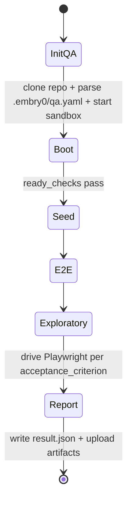

# Running QA

The **QA pipeline** boots a target full-stack application inside the orchestrator's DinD, drives a headless Chromium via Playwright MCP, and validates each acceptance criterion with screenshots, browser console, network activity, and per-service container logs as evidence.

Two ways to invoke it:

- **Standalone** — `POST /api/v1/jobs` with `pipeline=qa`, used for ad-hoc validation and CI smoke (instructions below).
- **PR-gated** — when triage decides `needs_qa=true` on an issue→PR job (based on `qa_required` in your `qa.yaml` plus diff heuristics), the QA pipeline runs after `review` succeeds and before the job ends. QA failure routes back to triage, which picks one of `retry_developer` (with diff guidance), `rerun_qa` (flaky/environmental), or `ask_user` (escalate). Bounded at 2 round-trips before failing with `ERR_QA_FAILURES_UNRESOLVED`.

See [architecture.md](architecture.md#qa-pipeline) for the full graph + per-job lifecycle.



## One-time repo integration

**Add a `.embry0/qa.yaml`** at the target repo's root (schema v2 — see [qa-yaml-reference.md](qa-yaml-reference.md) for the full field reference and monorepo examples):

```yaml
version: 2

defaults:
  mode: dind
  sandbox_profile: qa-node       # or qa-jvm, qa-python — see /sandboxes
  ready_checks:
    - http: "http://my-app:8080/healthz"
      expect_status: 200
  boot_timeout_seconds: 300
  acceptance_criteria_template:
    - "home page loads at frontend_url with no console errors"

qa_required: auto

apps:
  my-app:
    boot_command: "cd infra && docker compose -p qa_${QA_JOB_ID} -f docker-compose.yml -f ../compose.qa.override.yml up -d"
    frontend_url: "http://my-app-frontend:3000"
```

**Add a `compose.qa.override.yml`** (only if your `docker-compose.yml` uses an external network or the services rely on short DNS names like `redis`/`timescaledb`):

```yaml
networks:
  default:
    external: true
    name: ${QA_NETWORK_NAME}    # qa-net-{job_id}, set by embry0

services:
  # When the default network is external, Compose does NOT auto-register
  # service-name aliases — only container_name resolves. Add them explicitly
  # for any service whose short name appears in another service's config.
  redis:
    networks: { default: { aliases: [redis] } }
  timescaledb:
    networks: { default: { aliases: [timescaledb] } }
```

## Gotchas worth knowing up front

Every one of these caused a real debug round during integration:

- The startup command MUST use `-p qa_${QA_JOB_ID}` so cleanup can find the containers. Without it, every run leaks the entire stack into DinD.
- The startup command MUST pass `-f ../compose.qa.override.yml` explicitly — Compose doesn't auto-load it.
- Use the **prod** frontend service (built into the image), not a `frontend-dev` style service that bind-mounts source — bind-mount source paths inside DinD resolve on the DinD daemon's filesystem, not the QA sandbox's.
- Set `frontend_url` to a DNS-resolvable container hostname (`http://my-app-frontend:3000`), not `localhost:<host_port>` — the QA agent's headless Chromium runs inside the sandbox container.

## Trigger a run

```bash
curl -X POST http://localhost:8200/api/v1/jobs \
  -H "Content-Type: application/json" \
  -H "X-Requested-With: XMLHttpRequest" \
  -d '{
    "repo": "owner/my-app",
    "branch": "main",
    "pipeline": "qa",
    "qa": {
      "qa_timeout_seconds": 1800,
      "acceptance_criteria": [
        "home page loads at http://my-app-frontend:3000 with no console errors",
        "primary navigation is reachable"
      ]
    }
  }'
```

## Watching the run

Open `/jobs/{job_id}` in the dashboard — the QA tab streams the agent's tool calls, surfaces a polling thumbnail of the headless browser, exposes a live SSE log tail of `docker compose logs -f`, and renders the per-criterion result table with screenshot/log evidence once the agent finishes.

## Per-repo QA secrets

If your acceptance criteria require auth or other test credentials, add them in `/environments` under "QA Test Credentials" with `scope=qa`. They're injected only when the QA pipeline runs and never reach the prod-style `app` scope.
